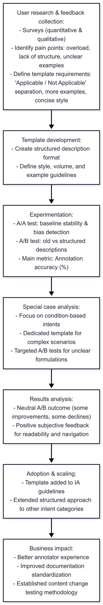
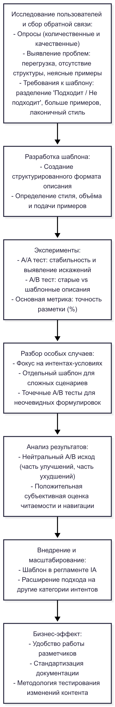

# 📄 Intent Description Optimization & Structured Template Implementation

---

## 🇬🇧 English version

**Timeline:** Q2 2024  
**Role:** Lead NLP/UX Researcher  
**Tech stack:** Python • SQL • A/B testing frameworks • BI tools • Survey tools  

### Context
Intent descriptions were poorly structured, difficult to read, and prone to duplication.  
Annotators reported low clarity, navigation difficulties, and frequent misclassifications.  
This negatively impacted labeling accuracy and slowed decision-making.

### Goal
- Improve clarity and usability of intent descriptions.  
- Increase annotation accuracy and speed.  
- Introduce a structured template to standardize formatting.  
- Validate improvements through A/A and A/B testing.  

### Approach

**User Research & Feedback Collection**  
- Conducted quantitative and qualitative surveys with annotators.  
- Identified key pain points: overloaded text, lack of structure, unclear examples.  
- Defined template requirements: clear “Applicable / Not Applicable” separation, more examples, concise style.  

**Template Development**  
- Created a structured description format based on feedback.  
- Defined style, volume, and example guidelines.  

**Experimentation**  
- Ran A/A tests to establish baseline stability and detect annotation biases.  
- Executed A/B test comparing old vs. structured descriptions.  
- Main metric: *Annotation accuracy* (% of correctly labeled messages).  

**Special Case Analysis**  
- Focused on condition-based intents (most error-prone group).  
- Designed a dedicated template for complex logical scenarios.  
- Conducted targeted A/B tests for unclear formulations.  

### Results
- A/B test results were neutral: improvements in some cases, slight declines in others.  
- Subjective feedback favored the new template for readability and navigation.  
- Template adopted in IA guidelines as a recommended structure.  
- Extended structured approach to other intent categories.  

### Business Impact
- Improved user experience for annotators.  
- Enhanced standardization in documentation.  
- Established testing methodology for content changes.  

### Key Skills Highlighted
- User research and feedback analysis.  
- Structured template design for NLP workflows.  
- A/A and A/B experiment design and execution.  
- Collaboration between analytics, annotation, and product teams.

### Data Pipeline

---

## 🇷🇺 Русский вариант

**Таймлайн:** Q2 2024  
**Роль:** Лид NLP/UX исследователь  
**Технологии:** Python • SQL • фреймворки для A/B тестов • BI инструменты • инструменты опросов  

### Контекст
Описания интентов были слабо структурированы, перегружены и часто содержали дубли.  
Разметчики жаловались на низкую понятность, трудности с навигацией и ошибки в классификации.  
Это снижало точность разметки и замедляло принятие решений.

### Цель
- Повысить ясность и удобство восприятия описаний интентов.  
- Увеличить точность и скорость разметки.  
- Внедрить структурированный шаблон для стандартизации формата.  
- Подтвердить улучшения через A/A и A/B тестирование.  

### Подход

**Исследование пользователей и сбор обратной связи**  
- Проведен количественный и качественный опрос разметчиков.  
- Выявлены болевые точки: перегруженность, отсутствие структуры, неочевидные примеры.  
- Определены требования к шаблону: чёткое разделение «Подходит / Не подходит», больше примеров, единый стиль.  

**Разработка шаблона**  
- Создан структурированный формат описания на основе фидбэка.  
- Определены требования к стилю, объёму и подаче примеров.  

**Эксперименты**  
- Проведен A/A тест для определения стабильности и выявления субъективных искажений.  
- Проведен A/B тест: сравнение старых и шаблонных описаний.  
- Основная метрика: *Точность разметки* (% правильно размеченных сообщений).  

**Разбор особых случаев**  
- Сфокусировались на интентах-условиях (наиболее проблемной группе).  
- Разработан отдельный шаблон для сложных логических сценариев.  
- Проведены точечные A/B тесты для неочевидных формулировок.  

### Результаты
- Результаты A/B теста — нейтральные: в части случаев улучшения, в части — небольшое ухудшение.  
- Субъективно команда оценила шаблон как более удобный и читаемый.  
- Шаблон закреплён в регламенте IA как рекомендуемая структура.  
- Подход расширен на другие категории интентов.  

### Бизнес-эффект
- Повышено удобство работы для разметчиков.  
- Улучшена стандартизация документации.  
- Выработана методология тестирования изменений в контенте.  

### Ключевые навыки
- Пользовательские исследования и анализ обратной связи.  
- Разработка структурированных шаблонов в NLP процессах.  
- Постановка и проведение A/A и A/B тестов.  
- Координация между аналитиками, разметчиками и продуктовой командой.

### Пайплайн

